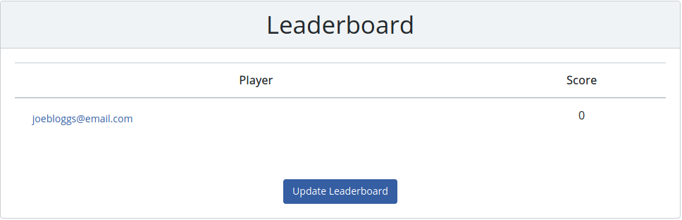
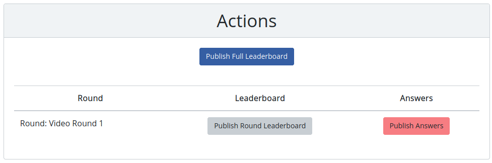
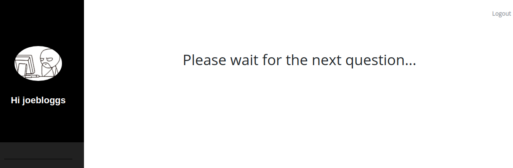

# quizmaster-frontend
The frontend for the [Quizmaster application](https://github.com/daithihearn/quizmaster)

# Reqirements
You must have NPM installed and the [quizmaster-api](https://github.com/daithihearn/quizmaster-api) must be running. You can run the frontend separately to the [quizmaster-api](https://github.com/daithihearn/quizmaster-api) or you can serve the frontend via a webjar in the [quizmaster-api](https://github.com/daithihearn/quizmaster-api). See the [top level readme](https://github.com/daithihearn/quizmaster) for more information on deployment options.

# Technical Stack
- NPM
- React
- Gradle (for webjar packaging)

# Building
To build this app into a webjar simply run the `./build.sh` script. Or to run it just run `npm start`.

# Functionality
There are two personas in this application. The Admin is the quizmaster. They have the ability to create new quizzes, start a game and run a game. The player can only play a game. Questions will be served up to them and they will answer the.
## Creating a Quiz (Admin)
To create a quiz simply log in and click the `Create Quiz` button. You will first be prompted to give the quiz a name. You will then be brought to a screen where you can create questions and rounds. First add some questions. The questions will appear in a table as you add them. They can be deleted from this table but it is not yet possible to modify a questions. The `Round name`, `Question` and `Answer` fields are mandatory, but all other fields are optional. The `Round name` is only stored when you submit the round.

When you have entered the questions for a round, click `Submit Round`. The round will appear in the rounds list. You can delete rounds but it is not yet possible to modify a round.
When all of the rounds are added, click on the `Submit Quiz` button. At this point the entire quiz will be posted to the API. Before this everything has happened locally on the browser. Progress is persisted to the local browser storage, so you can return to creating a quiz provided you use the same browser.

### Adding Images
You can add images to your question. Any URI is supported including the data URI. However, if you are using the data URI be conscious that this will be persisted as a string to MongoDB. You may want to reduce the image size.

### Adding Media
You can also add audio and video content. We are using [React Player](https://www.npmjs.com/package/react-player) so please refer to their documentation for details on the supported media types. My recommendation is to use a cloud provider such as Google Drive to store the content, then create a direct link to that content. Please note that most cloud providers don't give you direct links easily. [This tool](https://sites.google.com/site/gdocs2direct/) might come in handy if you're using Google Drive. 

## Starting a Game
To start a game, select a quiz from the dropdown list on the landing page. Then enter an email address for all of the quiz participants. An email will be sent to each participant with a link to log into the quiz. They should only have to click the link to enter the quiz. In dev mode, no email will actually be sent. The links will be logged to the console. There is a requirement to configure an email service. Personally I deploy with [Heroku](https://www.heroku.com/) and use the free [SendGrid](https://app.sendgrid.com/) email service.
Please note that once a game is started it not yet possible to retrospectively add players.

## Running a Game
Once you have started a game, you will be redirected to the game dashboard. All active games will also be shown in a table on the home screen. The rounds and questions will appear in the first panel:

Simply click on the `Pubish` button beside a question to push it to the players. Players that are logged into the game will see the question appear instantaneously. We are using `WebSockets` to publish the content to all subscribers. We also cache the last published content so that if a player leaves the screen they can pick up where they left off. The flow of the quiz is entirely up to the admin. You can publish any order you like.

As players answer the questions, the api will attempt to mark the answers. The marking algorithm is configurable. You can make it more or less sensitive. You can also force manual marking of a question when creating the quiz. If the algorithm can't resolve the answer it will be pushed to the admin. All unresolved answers will pop up in the `Answers for Correction` panel. You can then manually mark the answers.

You can update your own leaderboard at any time by clicking the `Update Leaderboard` in the `Leaderboard` panel. This will only update your local leaderboard.

The `Actions` panel contains all actions that the admin can do apart from publishing questions. They can publish the ansers to a round, publish the leaderboard for a round or publish the overall leaderboard. As mentioned before you can run the quiz with whatever flow you like. You as the admin are publishing content the player. They will just receive whatever you publish.

## Player
The entrypoint for a player is usually a link sent via email when the admin starts the game. when they click the link they should see a page like this:

When the admin publishes a question they will see something like this:

The player can then submit their answer and they will return to the waiting screen.

